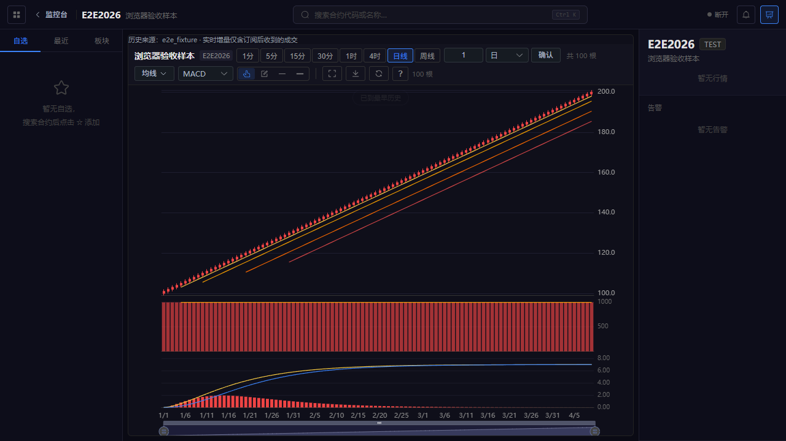
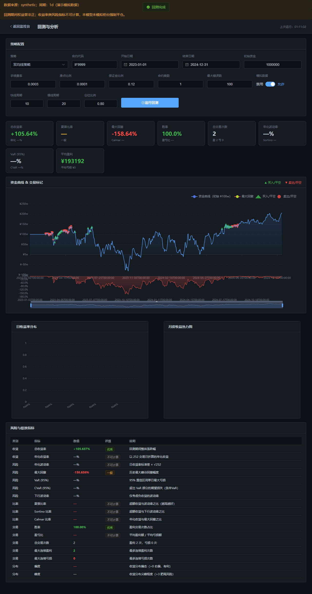

# 全局整改结果（2026-10-05）

仓库 `D:/mine/quant`，分支 `fix/global-review-20261004`，原始基线 `8dd7b5d`。本次以本地分阶段提交保留修改，没有推送、创建 PR、部署、登录真实柜台或发送真实委托。

## 完成情况

55 项均已逐项处理和记录：**41 项已修复并离线验证，7 项代码已改进但待外部验收，7 项部分完成**。三个 P0（Q03/Q04/Q11）的已复现漏洞均已修复。这里的“已修复”仅指审查中明确缺陷通过对应离线回归，不代表整套交易系统可直接实盘。

修复覆盖唯一入口、账户隔离、风控预留、撤单/改单/预埋单、成交账本、回测撮合与统计、来源治理、图表竞态、连接生命周期、依赖升级和运行工具。保留原始审查报告，不把后续改进回写成原始审查时已经成立的事实。

## 验证证据

- 后端完整 pytest：119 passed；Ruff 覆盖 main.py/server.py/src/tests；Mypy 29 文件通过。
- 后端 src 行覆盖率约 65%（原审查隔离测试约 41%，测试集合及代码结构已变化，数字不能当成完全同口径增长）。CTP 原生适配器覆盖率仍低。测试保留 1 条 Starlette 对 httpx TestClient 的弃用提示，未将其隐藏。测试保留 1 条 Starlette 对 httpx TestClient 的弃用提示，未将其隐藏。测试保留 1 条 Starlette 对 httpx TestClient 的弃用提示，未将其隐藏。
- 前端 lint、strict vue-tsc、11 项 Vitest、生产构建通过；4 项 Playwright 通过，包含真实 HTTP 离线回测、真实 Worker 历史图、授权 WS 接收及注销撤销。
- npm audit：0 告警。对 Python 开发锁 39 个包逐版本查询 PyPI JSON vulnerabilities 字段：未检出公告；不是全环境二进制扫描。
- ECharts 构建块 734,098 bytes（审查约 1,119 kB）；Element Plus 882,069 bytes（审查约 982 kB）。预算分别 760,000/910,000 bytes；仍超过 Vite 的通用 500 kB 提示，未隐藏警告。
- 6000 根 bar 单合约本地回放保留 2000 根。两个已饱和窗口中位耗时约 1.63/1.53 ms，tracemalloc 已分配内存约 500/514 kB；仅取两个观察点。详细实测见 evidence/benchmark-verified.json；该基准不代表原生柜台吞吐。
- SQLite 备份/恢复、进程锁、重开账本去重、急停恢复、持久审计、指标标签上限均有测试。
- 环境：Python 3.12.14、Node 24.19.0、Windows x64。原生 CTP 未安装完成；未运行实际交易，也没有把休市网络现象归为程序缺陷。

证据目录：本报告旁的 [evidence](evidence/) 存放最终检查输出、依赖查询和截图；完整工作日志另保存在 `D:/mine/quant-audit-20261004`。GitHub Actions 已配置，尚未远程触发。

## 仍未闭环的事项

1. **CTP 和柜台事实**：Q13/Q19/Q20/Q22/Q35 需要原生扩展、测试账户、柜台回报和交易时段。已用明确就绪门禁和未知字段拒绝/标记避免“假成功”。
2. **交易日历和 bar 一致性**：Q09/Q36/Q37 缺权威日历、夜盘分节、节假日数据，以及历史预热和完整回放对照。已改为事件时间聚合，未宣称所有小时/周线与交易所完全一致。
3. **完整恢复和生产能力**：Q21/Q49 缺柜台全量委托差异闭环、未知 intent 受审计解决流程、原生灾难恢复。账本异常阻止重复报单；本地预埋单不自动恢复。
4. **环境和性能**：Q51/Q54 尚缺完整 live 依赖解析锁、干净主机安装、真实负载基准及自动归档。Q52 持久分钟权益已建立，但正式跨日绩效仍需数据与实现。
5. **历史凭据**：Q48 仅所有者能够确认历史码的归属及有效性；没有输出其值、尝试认证或擅自清理 Git 历史。

当前回测模型仍为 bar/固定保证金与费率；不模拟强平、逐日结算或订单排队。权益非正会显示警告并将收益率类风险指标标为不可计算；不能用演示模拟曲线评价策略。内置策略反手不再同时发平仓和反向开仓，也不会因为开仓预算不足跳过必要平仓。

## 逐项结果

| 编号 | 状态 | 实际变更 | 验证 | 残余事项 |
|---|---|---|---|---|
| Q01 | 已修复（离线验证） | 入口初始化和日志导入修复；CLI 纳入 Ruff | test_review_auth.py | — |
| Q02 | 已修复（离线验证） | 统一 API 工厂，旧拆分模块改为兼容门面 | test_review_auth.py | 后续可继续模块化，但不得重建第二份状态 |
| Q03 | 已修复（离线验证） | 注销须认证；新连接就绪后原子切换，失败保留原账户 | test_review_auth.py | — |
| Q04 | 已修复（离线验证） | 会话绑定账户代次；账户转换串行化；旧会话统一撤销 | test_review_auth.py | — |
| Q05 | 已修复（离线验证） | WS 消息与广播复核会话，撤销后关闭；校验 Origin | test_review_auth.py；Playwright 注销验收 | — |
| Q06 | 已修复（离线验证） | 匿名状态不含账户和日志；日志接口受保护 | test_review_auth.py | — |
| Q07 | 已修复（离线验证） | CORS 放在认证外层，允许精确 Origin 的预检 | test_review_auth.py | — |
| Q08 | 已修复（离线验证） | 策略只消费声明合约且必须处于运行状态 | test_trading_engine_auto_strategy.py | — |
| Q09 | 部分完成 | 按事件时间/TradingDay 聚合 bar；内置策略反手等待委托完成 | test_review_execution.py | 小时桶仍按时钟切分；缺交易所分节日历、历史预热和逐 bar 实盘/回测一致性验收 |
| Q10 | 已修复（离线验证） | 撤单请求不提前终结；撤改单等待柜台 CANCELLED，保留方向/开平和未成交量 | test_review_trading.py | — |
| Q11 | 已修复（离线验证） | 预埋单统一经过风险入口；保护单使用平仓；拒单保留 REJECTED 状态 | test_review_trading.py | 预埋单仍为本地条件单，重启不自动恢复触发 |
| Q12 | 已修复（离线验证） | 风控检查/提交/预留共用锁；所有活动开仓委托保留资金和数量预留 | test_review_trading.py | 资金采用保守预留，可能和柜台已冻结资金重复计入 |
| Q13 | 代码已改进，待外部验收 | 保留多空腿、净空符号、冻结量和今昨仓；选对手方向校验平仓量 | test_review_trading.py；test_review_execution.py | 柜台平今/平昨字段和特殊交易所规则仍须真实验证 |
| Q14 | 已修复（离线验证） | 紧急停止不依赖可选 enabled；缺行情、过期行情和必要账户字段拒绝新增风险 | test_review_trading.py | — |
| Q15 | 已修复（离线验证） | 交易日基线持久化；平仓不受日亏开仓门禁误拦；策略无开仓预算仍可平仓 | test_review_trading.py；test_review_execution.py | — |
| Q16 | 已修复（离线验证） | 成交显式保留 offset、交易日、交易所及账户；按腿更新持仓 | test_review_execution.py | — |
| Q17 | 已修复（离线验证） | SQLite 账本与成交复合唯一键；重放幂等；提交 intent 先落盘 | test_review_execution.py；test_review_runtime.py | — |
| Q18 | 已修复（离线验证） | 手数按乘数、保证金、可用资金和执行权重计算；回测成交回传策略 | test_review_execution.py；test_review_backtest.py | — |
| Q19 | 代码已改进，待外部验收 | 真实适配器只接限价；快捷平仓取新鲜买卖报价并确认 | test_review_trading.py；前端 lint/build | 真实柜台限价、滑点与报价时效需交易时段验收 |
| Q20 | 代码已改进，待外部验收 | 使用结构化 MD/TD、结算/合约/账户/持仓事件形成就绪门禁 | test_review_gateway.py | 原生回调包装仅做了 FakeGateway/模拟原生对象测试；没有真实连接证据 |
| Q21 | 部分完成 | 核对接口标明 snapshot_only、未决 intent 和缺失活动委托回放；异常状态阻止重发 | test_review_execution.py；test_review_runtime.py | 尚无完整柜台委托查询与差异闭环、未知 intent 自动解决流程 |
| Q22 | 代码已改进，待外部验收 | 账户字段使用原始回报 extra；不再把冻结资金当保证金；未知成交费用/盈亏为 null | test_review_gateway.py | 需核对特定柜台 raw 字段，成交费率和按策略归因尚未完整计算 |
| Q23 | 已修复（离线验证） | 参数白名单和数值约束；构建新策略后受锁替换，保存参数；失败不留下半配置 | test_review_execution.py | — |
| Q24 | 已修复（离线验证） | 权重校验并应用手数预算、展示和持久化 | test_review_execution.py | — |
| Q25 | 已修复（离线验证） | 回测持仓源与策略共享，成交/盯市同步资金；反手平开分阶段 | test_review_backtest.py；test_review_execution.py | — |
| Q26 | 已修复（离线验证） | 下一 bar 撮合、限价/止损可达、共享成交量、部分成交、委托关联和结束撤单 | test_review_backtest.py | 固定保证金和费率模型；没有盘口队列、逐日结算或强平模型 |
| Q27 | 已修复（离线验证） | 回撤内部使用比例，仅展示层乘 100 | test_review_backtest.py | — |
| Q28 | 已修复（离线验证） | 完整平仓回合配对双方手续费；标记用 offset；无亏损时盈亏比为 null | test_review_backtest.py | 未平回合不计入已完成交易 |
| Q29 | 已修复（离线验证） | 非有限值转换 null；短样本和非正权益的收益率指标不伪造数值 | test_review_backtest.py；Playwright 离线回测 | — |
| Q30 | 已修复（离线验证） | 捕获策略显式报错和异常；partial/failed/cancelled 不返回普通完成 | test_review_backtest.py | — |
| Q31 | 已修复（离线验证） | 回测并发 2、120 秒协作取消，单次 10000 根；SQL 有界读取 | test_review_backtest.py；test_review_data.py | 取消为协作式；本机内置策略可终止，不支持不可信任意插件执行 |
| Q32 | 已修复（离线验证） | 分钟缺失返回缺数据，不伪造；周线/各周期独立读取 | test_review_data.py | — |
| Q33 | 已修复（离线验证） | 模拟数据必须显式允许、仅临时使用；保留逐行及混合来源 | test_review_data.py；Playwright 来源提示 | — |
| Q34 | 已修复（离线验证） | 结束日期使用次日半开边界；统一时区及存储时间格式 | test_review_data.py | — |
| Q35 | 代码已改进，待外部验收 | 可交易目录来自柜台合约元数据；历史合约标记不可据此交易；移除硬编码过期热门合约 | test_review_gateway.py；test_review_data.py；浏览器历史图 | 挂牌目录、交易所及保证金率仍须柜台核验 |
| Q36 | 代码已改进，待外部验收 | 增加 CSV 导入、OHLC/有限值/时间校验，保留来源与调整/换月元数据 | test_review_data.py；maintenance CLI | 没有接入权威节假日/交易时段供应源；缺口判断明确标记 heuristic |
| Q37 | 部分完成 | 实时 bar 按 tick 事件时间、成交量增量聚合，标记订阅后部分数据 | test_review_execution.py；test_review_data.py | 跨夜小时线和分节时段待权威日历；不能从中途订阅恢复完整历史 OHLC |
| Q38 | 已修复（离线验证） | 请求取消和 generation 校验；切换合约/周期隔离旧响应 | review-data.spec.js | — |
| Q39 | 已修复（离线验证） | 完整传递 before 游标，历史数据与指标按同一索引拼接 | review-data.spec.js | — |
| Q40 | 已修复（离线验证） | Worker 使用普通 DTO；内容缓存、超时清理和纯函数回退 | review-data.spec.js；Playwright 真实 Worker | — |
| Q41 | 已修复（离线验证） | 实时 bar 合并后同步时间轴、价格、量和指标，异步计算校验上下文 | review-data.spec.js；浏览器图表验收 | — |
| Q42 | 已修复（离线验证） | 导入无副作用；登录门禁、消费者引用计数、注销和卸载清理 | review-ws.spec.js；Playwright 注销验收 | — |
| Q43 | 已修复（离线验证） | 接收/推送任一退出即取消另一侧；并发限时广播、连接/订阅/待发送上限 | test_review_auth.py；Playwright WS 生命周期 | — |
| Q44 | 已修复（离线验证） | 重连补快照和版本合并；查询失败保留并标记旧数据；成交复合去重 | review-ws.spec.js | — |
| Q45 | 已修复（离线验证） | 本地离线研究与 CTP 连接分离；生产公开研究需显式配置 | Playwright 完整离线回测；test_review_backtest.py | 多用户生产研究身份管理仍是独立扩展需求 |
| Q46 | 已修复（离线验证） | 统一超时/取消/错误详情/请求 ID；登录重复提交受控，迟到连接隔离 | test_review_auth.py；review-data.spec.js | — |
| Q47 | 已修复（离线验证） | 升级并固定前端直接/传递版本，移除镜像来源；功能与浏览器回归 | npm-audit-after.json；frontend-verified.txt；browser-e2e-verified.txt | 公告查询时点为 2026-10-05，零告警不是永久无风险保证 |
| Q48 | 代码已改进，待外部验收 | 真实配置忽略规则修复；配置/私钥标记扫描接入 CI；样例凭据空值 | scripts/check_secrets.py；git check-ignore | 历史三个授权码的归属、有效性和是否需轮换，必须由所有者核实 |
| Q49 | 部分完成 | 单实例锁、loopback、无 reload；持久账本/急停/基线/权益；备份恢复工具和演练 | test_review_runtime.py；OPERATIONS.md | 跨机器/工作目录需要部署保证单执行者；真实未决委托恢复未验收，本地预埋单不自动恢复 |
| Q50 | 已修复（离线验证） | 完整测试、入口 Ruff、29 文件 Mypy、前端 strict、11 单测/4 E2E 和 Windows CI | backend-verified.txt；coverage-verified.txt；frontend-verified.txt | Mypy 不覆盖全仓，前端 checkJs 仍 false；远程 CI 尚未推送触发 |
| Q51 | 部分完成 | Windows/Python3.12 的研究/开发传递版本锁、Node24 约束、环境检查、统一文档 | requirements-*.lock；scripts/check_environment.py | CTP 原生候选组合和干净主机安装尚未完成验收；live 依赖尚无完整解析锁 |
| Q52 | 部分完成 | 分离回报距今、MD/TD 就绪；RTT 无测量时未知；秒级夏普移除，分钟权益落盘 | test_review_gateway.py；test_review_runtime.py；前端质量门 | 跨日正式绩效服务尚未实现；需要足量真实日终样本 |
| Q53 | 已修复（离线验证） | SQLite 持久审计、actor/request ID/脱敏；路由模板和有界指标键、标签编码 | test_review_runtime.py | 审计/执行库需运维归档，尚未自动分区 |
| Q54 | 部分完成 | 历史/信号/成交/已完成订单有界，bar 频率计算；按需图表和图标，建立构建预算 | benchmark-verified.json；scripts/check_bundle.mjs | 仅单合约离线基准；尚非增量全指标实现，生产行情负载和数据库归档策略待验收 |
| Q55 | 已修复（离线验证） | 消除 timeout 遮蔽；交易包装不盲目重试，未知结果明确阻塞 | test_review_trading.py | — |

## 运行与后续验收

按 [README](../README.md) 启动离线研究；生产约束、恢复步骤和交易时段验收见 [OPERATIONS](OPERATIONS.md)。不要把研究验证通过等同于实盘授权或可部署结论。

依赖元数据来源：[PyPI vnpy](https://pypi.org/project/vnpy/4.4.0/)、[PyPI vnpy_ctp](https://pypi.org/project/vnpy_ctp/6.7.11.4/)。原生接口参考 [vnpy_ctp 官方源码](https://github.com/vnpy/vnpy_ctp/blob/main/vnpy_ctp/gateway/ctp_gateway.py)。本次 PyPI 漏洞查询逐包地址和结果保存在证据 JSON（name/version 对应 `https://pypi.org/pypi/<name>/<version>/json`）。

## 浏览器截图

