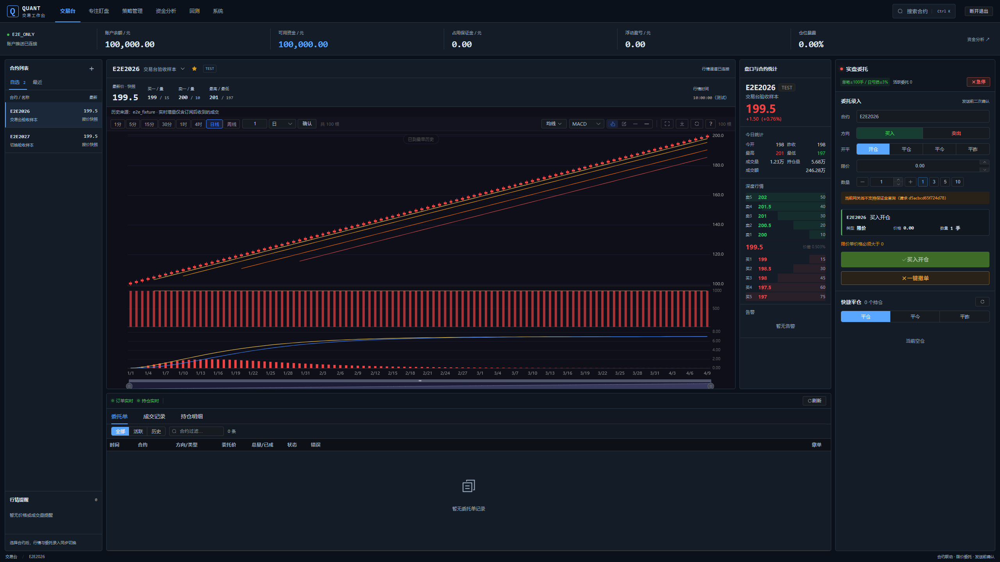

# 2K 单屏交易台布局改造

目标：按用户的 2K 单屏工作环境，让行情、委托录入、盘口和委托持仓在同一工作区内可见。已有首页将资金图表、策略管理、手动交易和订单簿纵向堆叠，主内容最大宽度仅 1600px；在 2560px 宽的窗口内留下较多两侧空白，下单区也位于长页面下方。

## 现在的布局

| 区域 | 内容与操作 |
|---|---|
| 顶部导航 | 交易台、专注盯盘、策略管理、资金分析、回测、系统；合约搜索与退出 |
| 账户状态栏 | 账户推送状态、余额、可用资金、占用保证金、浮动盈亏、仓位暴露 |
| 左侧 | 自选/最近合约、报价快照、行情提醒；选择合约联动图表及委托录入 |
| 中央上部 | 当前合约、最新及买卖一价、行情时间、K 线、指标、画线、全屏与导出 |
| 中央右侧 | 宽屏常驻合约统计与盘口；卖五到卖一由上至下，卖一接近最新价及买一 |
| 右侧 | 委托表单、保证金状态、价格与手数预览、下单、全部撤单、急停、快捷平仓 |
| 中央下部 | 委托、成交、持仓标签页；长表格内部滚动，保留右侧操作区 |
| 侧滑面板 | 资金分析与策略管理，关闭后保留当前委托表单 |

移除 1600px 内容上限。浏览器可用宽度达到 1850 CSS px 时为四栏；2200px 以上加宽自选、盘口及委托区。较小桌面为三栏；平板收起自选，窄屏顺序排列主要区域。断点按浏览器可用宽度计算，操作系统缩放或浏览器缩放可能让 2K 物理屏幕进入较小断点。

图中行情来自 Playwright 拦截的具名测试消息，历史来源为 `e2e_fixture`，账户为 `E2E_ONLY`；不是实盘价格、账户余额或成交记录。盘口空缺时仍显示等待行情，不为排版填充假报价。

## 交互与修复

- 合约选择使用既有 watch store，联动自选、行情与委托表单。切换合约会清空旧限价，直到填写新价格才允许继续确认。
- 保留下单、撤单、急停和平仓的独立确认。测试只打开并取消确认框，拦截全部交易写请求，确认没有发出任何交易写请求。
- 桌面将方向、开平、限价、手数顺序排列；买卖选中态使用对应色及文字，避免原有绿色文字叠在亮蓝底上。
- 策略接口失败时提示错误并保留上次成功列表，移除自动填充模拟策略的路径。
- 修复盘口卖价档位标签与价格不对应，以及 CSS 再次反转卖盘的显示问题；测试同时检查价格、标签及屏幕上的上下位置。
- 资金图表增加卸载检查，防止侧滑面板关闭后迟到的图表加载继续初始化。

## 验证

| 检查 | 本轮结果 |
|---|---|
| 2560×1440、1920×1080、1366×768 | 行情、委托和订单簿位于首屏；无整页横向或纵向溢出；截图复核 |
| 768×844、390×844 | 无整页横向溢出；下单控件可滚动到达；小屏不保证全部面板同屏 |
| 联动与确认 | 切换合约清除旧价格；取消下单/全部撤单/急停确认不发送交易请求 |
| 图表及辅助入口 | 全屏尺寸、Ctrl+K 搜索焦点、Escape 关闭、资金面板保留表单、策略错误状态 |
| 订单表格 | 60 条具名委托样本在表格内部滚动，右侧下单按钮仍可见 |
| 前端质量门 | ESLint、vue-tsc、26 项单测、Vite 构建通过；包体预算通过 |
| 完整浏览器回归 | 16 项通过，其中本轮新增 5 项交易台验收 |
| 完整后端回归 | 最终 214 项通过；Ruff 通过；mypy 纳入的 39 个文件通过 |

后端首次回归有一次 `test_watch_websocket_heartbeat_and_subscription` 在 Starlette TestClient 退出上下文时抛出 `concurrent.futures.CancelledError`。随后该测试所在模块 16 项、完整后端 214 项均通过；本轮未修改后端生产代码，也不把未复现的取消异常宣称为已修复。首次日志及复核日志一起保存。测试仍有 Starlette/httpx 弃用、旧 pytest 缓存目录权限及前端大包提示。

测试位置：`front_end/tests/e2e/trading-layout.spec.js`。运行方式：前端 `npm run quality`，浏览器沿用独立端口 18000/55174 的 E2E 配置；后端使用 `.venv-live`，`QUANT_ENV=test`、`PYTHONUTF8=1`、清除外部 `PYTHONPATH`，运行完整 pytest、Ruff、mypy。执行日志、截图及哈希见 [证据目录](evidence/trading-layout-20261008/README.md)。

## 当前边界

保留现有实盘登录会话，本轮没有重启后端、没有实盘报单/撤单，也没有启停真实策略。此前两项后端补充修复仍待下次重启加载。前端刷新后可查看新布局；此举会重建页面连接，但无需主动退出账户。

行情通道连接状态仅代表浏览器连接，不能代替最新 Tick、柜台就绪或报价时效；面板明确显示行情时间及快照。真实连续行情、委托成交、断线恢复仍沿用既有未验收边界。未新增可拖拽布局、面板尺寸持久化或多屏弹出窗口。
